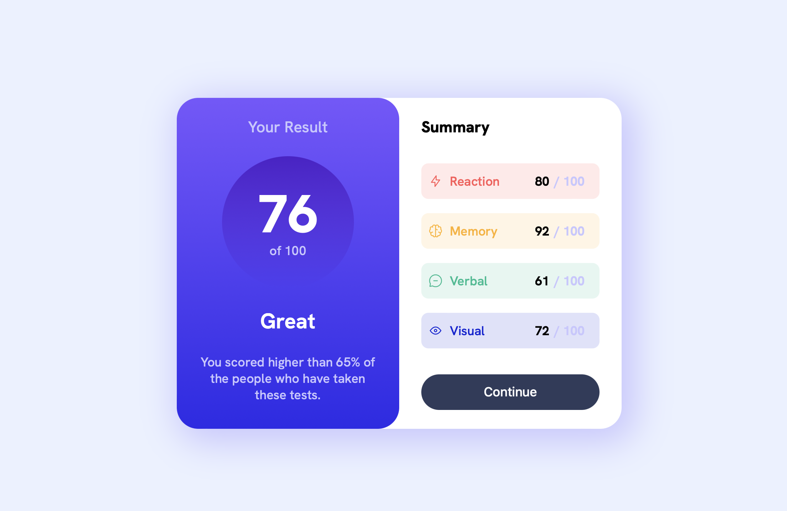

# Frontend Mentor - Results summary component solution

This is a solution to the [Results summary component challenge on Frontend Mentor](https://www.frontendmentor.io/challenges/results-summary-component-CE_K6s0maV). Frontend Mentor challenges help you improve your coding skills by building realistic projects. 

## Table of contents

- [Overview](#overview)
  - [The challenge](#the-challenge)
  - [Screenshot](#screenshot)
- [My process](#my-process)
  - [Built with](#built-with)
- [Author](#author)

## Overview

### The challenge

Users should be able to:

- View the optimal layout for the interface depending on their device's screen size
- See hover and focus states for all interactive elements on the page
- **Bonus**: Use the local JSON data to dynamically populate the content

### Screenshot

## My process

the test result is calculated in the render.js file, based on the file data in data.json

### Built with

- Semantic HTML5 markup
- CSS custom properties
- Flexbox
- Java Script

## Author

- Website - [Sokolov Pavel](https://kms4u.github.io/Sokolov_Web)
- Frontend Mentor - [@kms4u](https://www.frontendmentor.io/profile/kms4u)
